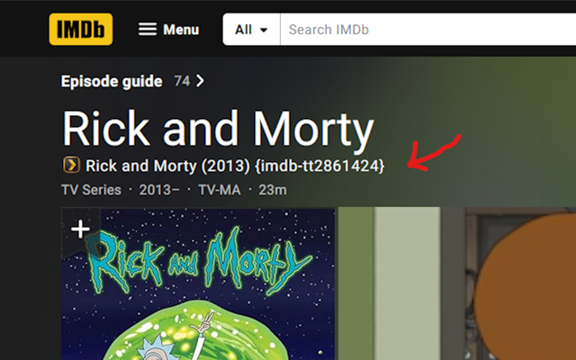
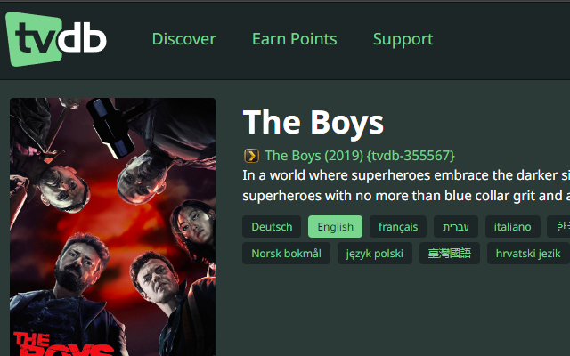
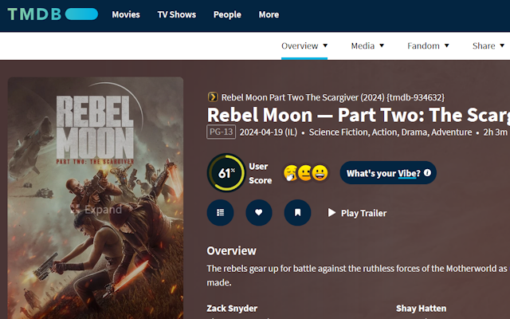

  

<h1 align="center" style="margin-top: -20px;">Plex Name Generator</h1>

*Plex Name Generator adds a formated string that matches Plex's naming convention. You can click on it to copy to your clipboard.*

<h3 style="margin-bottom:25px; margin-right:5px;">Choose your team:</h3>

<h3>Examples</h3>

    
    
    

#### <i>If you found this helpful and would like to support future side-projects, you may</i>

